# A Multi-Processing Engine Demo Using an Example of Transiting Flux Simulations

This demo is a display of how Iceberg helps to bring your compute to your storage, simplifying your overall infrastructure and not only maximizing the efficiency of your engineers, but also lowering the bar for integrating new compute engines into an organization's broader data ecosystem.

## Requirements
- [Docker](https://docs.docker.com/engine/install/)
- [Docker Compose](https://docs.docker.com/compose/install/)
- [Gradle 7+](https://gradle.org/install/)

## The Tools

### MinIO for Storage

Iceberg's storage is powered by its File I/O abstraction. This abstraction includes a minimal interface that's a small subset of full filesystem specs and includes only the required functionality to guarantee correctness and atomicity for Iceberg commits and transactions.

There are many File I/O implementations that come with Iceberg and many organizations internally implement their own custom ones. In this demo, we'll use the s3 implementation that comes with Iceberg and a local instance of MinIO which is s3-protocol compatible. MinIO comes with a nice UI that will let us visualize the underlying objects of tables.

```yaml
  minio:
    image: minio/minio
    container_name: minio
    environment:
      - MINIO_ROOT_USER=admin
      - MINIO_ROOT_PASSWORD=password
    ports:
      - 9001:9001
      - 9000:9000
    command: ["server", "/data", "--console-address", ":9001"]
  mc:
    depends_on:
      - minio
    image: minio/mc
    container_name: mc
    environment:
      - AWS_ACCESS_KEY_ID=demo
      - AWS_SECRET_ACCESS_KEY=password
      - AWS_REGION=us-east-1
    entrypoint: >
      /bin/sh -c "
      until (/usr/bin/mc config host add minio http://minio:9000 admin password) do echo '...waiting...' && sleep 1; done;
      /usr/bin/mc rm -r --force minio/warehouse;
      /usr/bin/mc mb minio/warehouse;
      /usr/bin/mc policy set public minio/warehouse;
      exit 0;
      "
```

### Postgres for the Data Catalog

Just like with File I/O, Iceberg's extensible catalog interface means there are many catalog implementations that can be used. Of course custom catalog implementations are another option and with the newly released REST catalog, designing a custom Iceberg catalog setup is more flexible than ever.

For this demo we'll use the JDBC catalog implementation supported by a postgres container.

```yaml
  postgres:
    image: postgres:13.4-bullseye
    container_name: postgres
    environment:
      - POSTGRES_USER=admin
      - POSTGRES_PASSWORD=password
      - POSTGRES_DB=demo_catalog
```

### Spark for Batch Operations

For ETL we'll use Spark, a popular framework for large scale ETL jobs with strong support for Iceberg tables. We'll use the `tabulario/spark-iceberg` image which comes with a Jupyter notebook server.

```yaml
  spark-iceberg:
    image: tabulario/spark-iceberg
    depends_on:
      - postgres
    container_name: spark-iceberg
    environment:
      - SPARK_HOME=/opt/spark
      - PYSPARK_PYTON=/usr/bin/python3.9
      - PATH=/usr/local/sbin:/usr/local/bin:/usr/sbin:/usr/bin:/sbin:/bin:/opt/spark/bin:/opt/spark/sbin
      - AWS_ACCESS_KEY_ID=admin
      - AWS_SECRET_ACCESS_KEY=password
      - AWS_REGION=us-east-1
    volumes:
      - ./notebooks:/home/iceberg/notebooks/notebooks
      - ./aws-core-2.17.131.jar:/opt/spark/jars/aws-core-2.17.131.jar
    ports:
      - 8888:8888
      - 8080:8080
      - 18080:18080
    entrypoint: /bin/sh
    command: >
      -c "
      echo \"
      spark.sql.catalog.demo.io-impl         org.apache.iceberg.aws.s3.S3FileIO \n
      spark.sql.catalog.demo.warehouse       s3a://warehouse \n
      spark.sql.catalog.demo.s3.endpoint     http://minio:9000 \n
      \" >> /opt/spark/conf/spark-defaults.conf && spark-sql -e 'CREATE DATABASE content' && spark-sql -e 'CREATE TABLE content.viewer_scores (first_name string, last_name string, score double)' && ./entrypoint.sh notebook
      "
```

### Trino for Online Analyitical Processing

For our OLAP engine we'll use Trino which comes with an Iceberg connector fully supported by the Trino open source community. We'll use Trino's JDBC interface makes it a flexible low-latency entrypoint to your Iceberg tables. Since Iceberg JDBC support hasn't been merged yet, we'll have to build PR [#11772](https://github.com/trinodb/trino/pull/11772) from source. Once this PR is in, we can just use the `trinodb/trino` image without having to build and mount the Trino server files as a volume.

```
git clone git@github.com:trinodb/trino.git
cd trino
git fetch origin pull/11772/head:11772
git checkout 11772
./mvnw clean package -DskipTests
```

Untar the Trino server into a sub-directory in this repo. (Assumes that you cloned this repo to `~/multi-engine-demo`)
```
mkdir ~/multi-engine-demo/trino/trino-11772
tar -xf core/trino-server/target/trino-server-392-SNAPSHOT.tar.gz -C ~/multi-engine-demo/trino/trino-11772
```

This is the configuration that's used in the docker-compose to mount the newly built Trino server and the custom Trino configuration that sets up the Iceberg catalog.
```yaml
  trino:
    image: trinodb/trino
    container_name: trino
    ports:
      - "8181:8181"
    volumes:
      - ./trino/etc:/etc/trino
      - ./trino/trino-pr-11772:/usr/lib/trino
```

### Flink for Streaming

Flink is a powerful and very popular open source processing engine for computations over data streams. We'll use Flink to generate randomized data and stream it directly into an Iceberg table stored in our MinIO container. We'll walk through the code for the Flink application but here are the contents of the `build.gradle` file that we'll use with gradle `7.3`.

```groovy
plugins {
    id 'java'
    id 'application'
    id 'com.github.johnrengelman.shadow' version '7.1.2'
}

group 'org.examples.flinkdemo'
version '1.0-SNAPSHOT'
mainClassName = 'org.examples.flinkdemo.SimulationDataSink'
sourceCompatibility = javaVersion
targetCompatibility = javaVersion
tasks.withType(JavaCompile) {
    options.encoding = 'UTF-8'
}
applicationDefaultJvmArgs = ["-Dlog4j.configurationFile=log4j2.properties"]

repositories {
    mavenCentral()
    maven {
        url "https://repository.apache.org/content/repositories/snapshots"
        mavenContent {
            snapshotsOnly()
        }
    }
}

dependencies {
    compileOnly group: 'org.apache.flink', name: 'flink-core', version: '1.15.1'
    compileOnly group: 'org.apache.flink', name: 'flink-streaming-java', version: '1.15.1'
    compileOnly group: 'org.apache.flink', name: 'flink-table-api-java-bridge', version: '1.15.1'
    implementation group: 'org.apache.hadoop', name: 'hadoop-common', version: '3.3.3'
    implementation group: 'org.apache.hadoop', name: 'hadoop-aws', version: '3.3.3'
    implementation group: 'com.amazonaws', name: 'aws-java-sdk-bundle', version: '1.11.1026'
    implementation group: 'org.apache.iceberg', name: 'iceberg-core', version: '0.14.0'
    implementation group: 'org.apache.iceberg', name: 'iceberg-flink-1.15', version: '0.14.0'
    implementation group: 'org.postgresql', name: 'postgresql', version: '42.1.4'
    implementation group: 'com.github.javafaker', name: 'javafaker', version: '1.0.2'
}

run.classpath = sourceSets.main.runtimeClasspath

shadowJar {
    project.configurations.implementation.canBeResolved = true
    configurations = [project.configurations.implementation]
    zip64 true
}
```

The gradle build includes the shadow jar plugin which allows building a "fat jar" as recommended by the Flink documentation.

### Superset for Business Intelligence

We'll use [Superset](https://superset.apache.org/) as a BI tool. Superset is an open-source tool with an expansive (and growing) set of charts that let you build highly customizable real-time dashboards out of the box. It comes with connectors to many different database backends.

```yaml
  superset:
    image: apache/superset
    container_name: superset
    entrypoint: ./superset-entrypoint.sh
    volumes:
      - ./superset-entrypoint.sh:/app/superset-entrypoint.sh
    ports:
      - "8088:8088"
```

In order to automatically have a Superset login available for the demo, we'll use this script as our entrypoint.

```sh
#!/bin/bash

pip install sqlalchemy-trino

./usr/bin/run-server.sh & superset fab create-admin \
              --username admin \
              --firstname Superset \
              --lastname Admin \
              --email admin@superset.com \
              --password admin

superset db upgrade
superset init

/usr/bin/run-server.sh
```

## High-Level Overview

As stated in the intro, this demo is meant to serve as an example of what's possible when you bring various compute engines to a unified data layer that's powered by Iceberg. This example contains popular open source tools in each category, however many of them can be swapped out or appended to by other tools and platforms that support Iceberg.

### Infra Diagram

Here is a diagram of the different tools used in this demo and the interaction points.

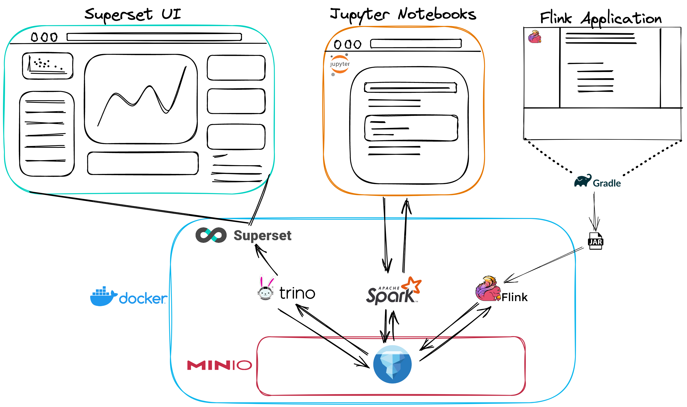

### An Astronomy Case of Use

To make this feel real, the example code runs fake simulations of an event in astronomy called a "transit". In summary, a transit event is when a celestial body (a planet) moves in between the observer (a telescope) and a larger body (a star). This causes a decrease in the measured brightness (flux) of the star and that difference can be measured. The change in flux is representative of the size of the celestial body.


The Flink application contained in the repo has a single argument `--starRadius`. Submitting this to the flink cluster starts a simulation where randomly sized planets transit around the star, modeled by a decrease in flux. The simulated data will be streamed into an Iceberg table using MinIO for storage and Postgres as a JDBC Catalog. We can then query the data in real time using Trino and build Superset dashboards to view the simulation in realtime.

## Demo

### Starting the Environment

To start up the demo, clone this repo and run the Docker compose file.

```sh
git clone <repo>
cd <repo>
docker-compose up
```

- Flink UI: [localhost:8081](http://localhost:8081)
- Trino UI: [localhost:8181](http://localhost:8181)
  - user: **admin**
- Superset UI: [localhost:8088](http://localhost:8088)
  - user: **admin**
  - password: **admin**
- Spark Master: [localhost:8080](http://localhost:8080)
- Spark History: [localhost:18080](http://localhost:18080)
- Notebook Server: [localhost:8888](http://localhost:8888)
- MinIO Console: [localhost:9001](http://localhost:9001)
  - user: **admin**
  - password: **password**

#### Connecting Superset to Trino

Let's add a database in superset that uses Trino as a backend. Navigate to the database page and open the
"Connect a database" modal. Choose Trino from the drop-down of supported databases. For the display name,
use Trino-Iceberg and for the SQLAlchemy URI use `trino://admin@host.docker.internal:8181/?catalog=iceberg`.

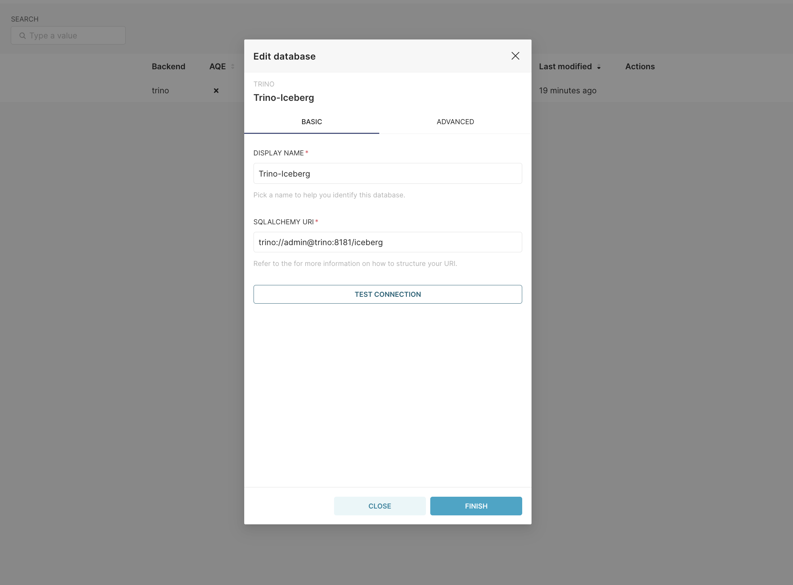

Next, add the `transit.simulations` dataset.

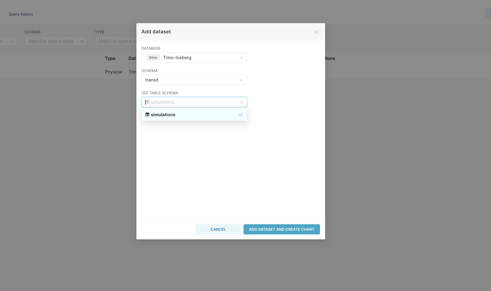

#### Creating Charts in Superset

Here are three charts but feel free to add more using any of the chart types that come with Superset.

*A "Big Number" chart that shows the numebr of flux readings*
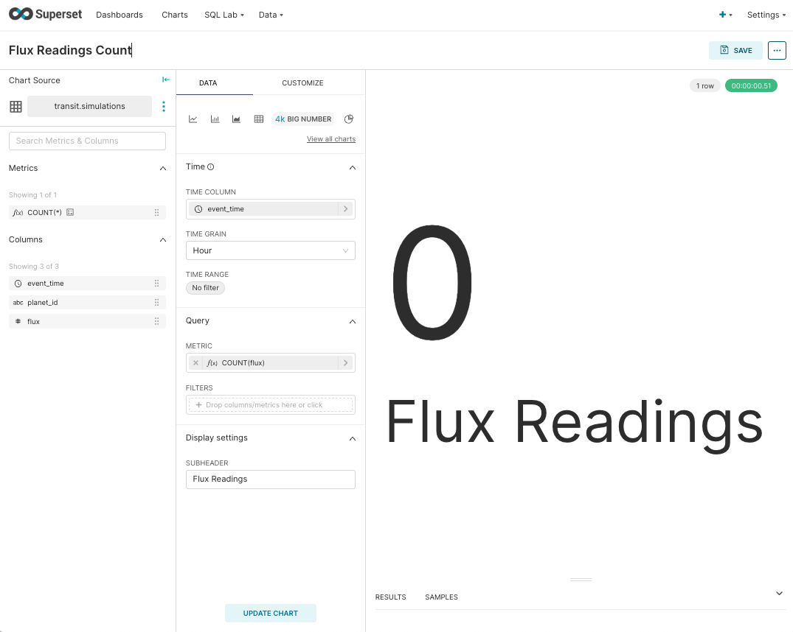

*A scatter plot that shows flux readings over time*
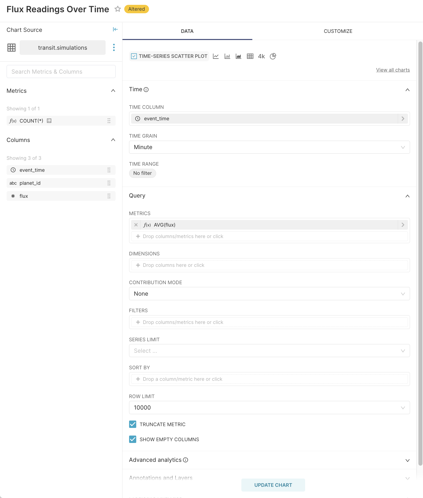

*A bar chart that shows the minimum flux reading for each planet*
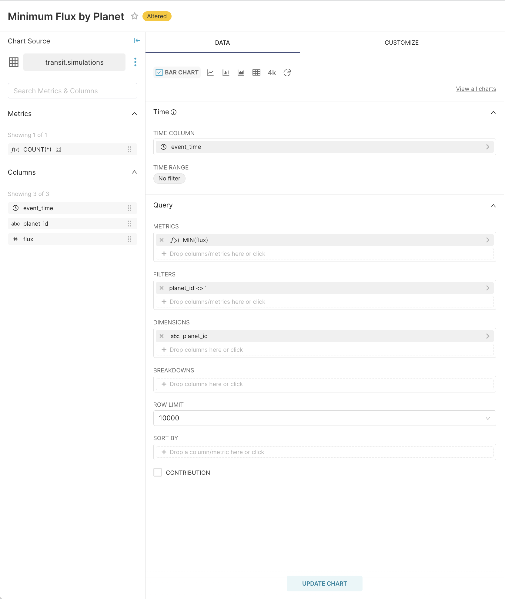

We haven't started streaming records yet so all of the charts should render empty.
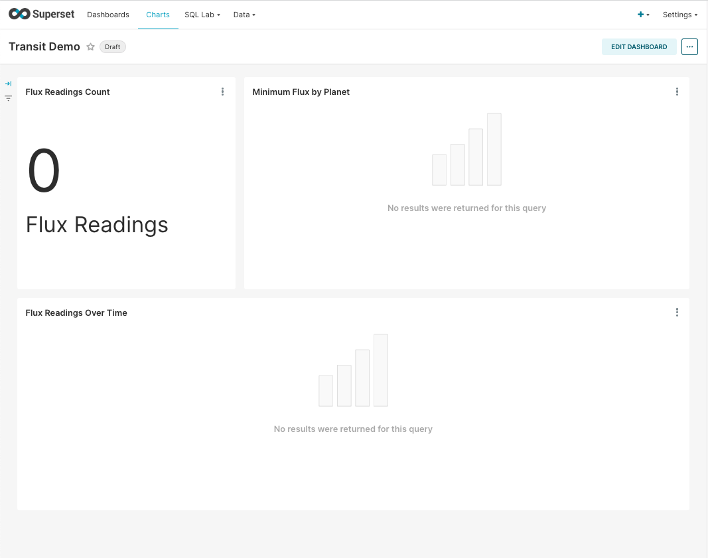

#### Build and Submit the Flink Streaming App

To build the Flink streaming application, run the build command in the root of this repo. Use the shadowJar plugin to produce a fat jar.
```
./gradlew clean shadowJar
```

Navigate to the Flink UI and go to the "Submit a New Job" tab. Use the "+Add New" button and upload the fat jar which you can find in `build/libs/FlinkToIceberg-1.0-SNAPSHOT-all.jar`.

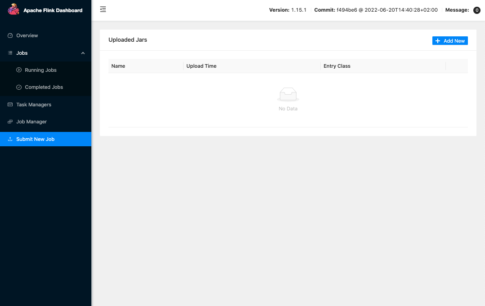

Before submitting the job, set the star radius for the simulation by adding `--starRadius 1.17` to the parameter input.

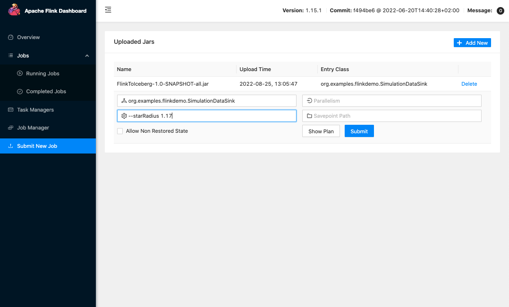

Once the job is submitted, you should see the Flink app start running and streaming data into the Iceberg table `transit.simulations`.

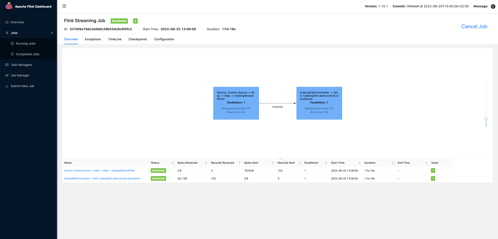

#### Superset Dashboard Updates

As the Flink application streams data into the Iceberg table, that data is immediately available for querying through Trino. This means the dashboard, which uses Trino as a backend,
will immediately as the data pours in. After about a minute or so, you should see the dashboard populate with about 300k flux readings.

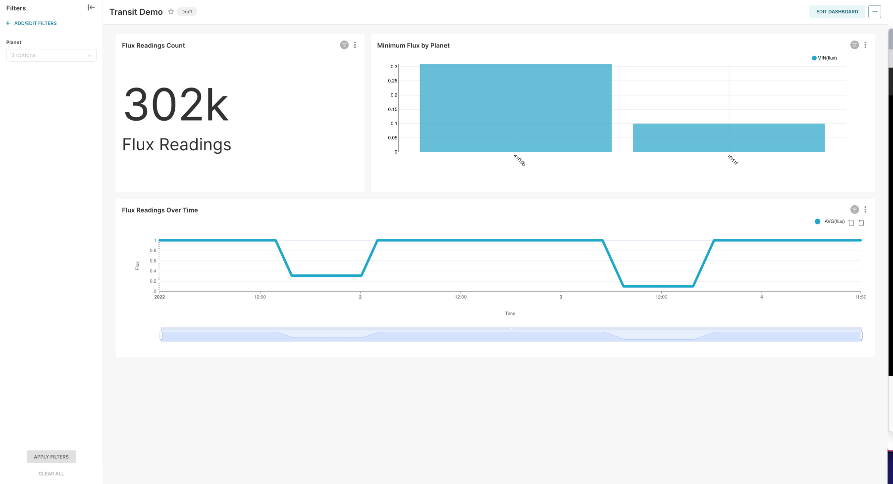

As more readings are added, you can see the transits generated by the randomly sized planets.

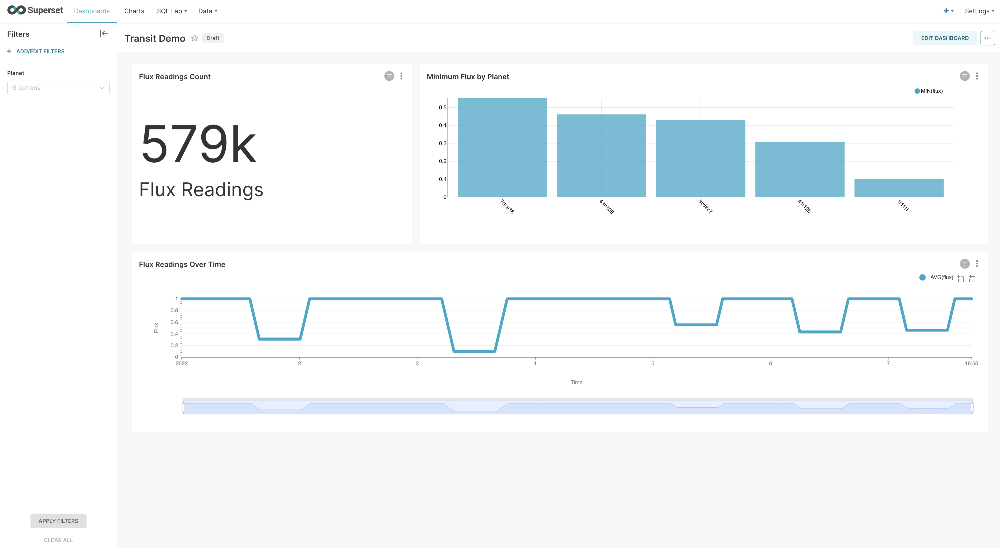

Using the filter on the left, you can select a random planet's ID to filter the dashboard to that specific planet.

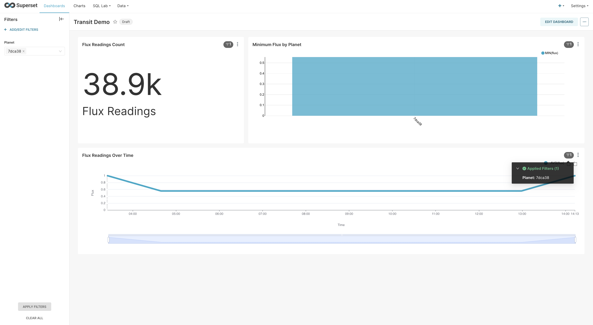

## Conclusion

This demo shows how Iceberg enables various processing engines to work with the same underlying data. Batch processing, real-time streaming, and business intelligence are very different workflows and
are often handled by separate teams within an organization. Using an open table format that each tool understands brings these teams closer together and can greatly simplify a data infrastructure stack.
This is just scratching the surface and Iceberg comes with a ton of powerful features that are exposed through each of these processing engines. As Iceberg support continues to grow, even more tools will
become available in each of these categories!